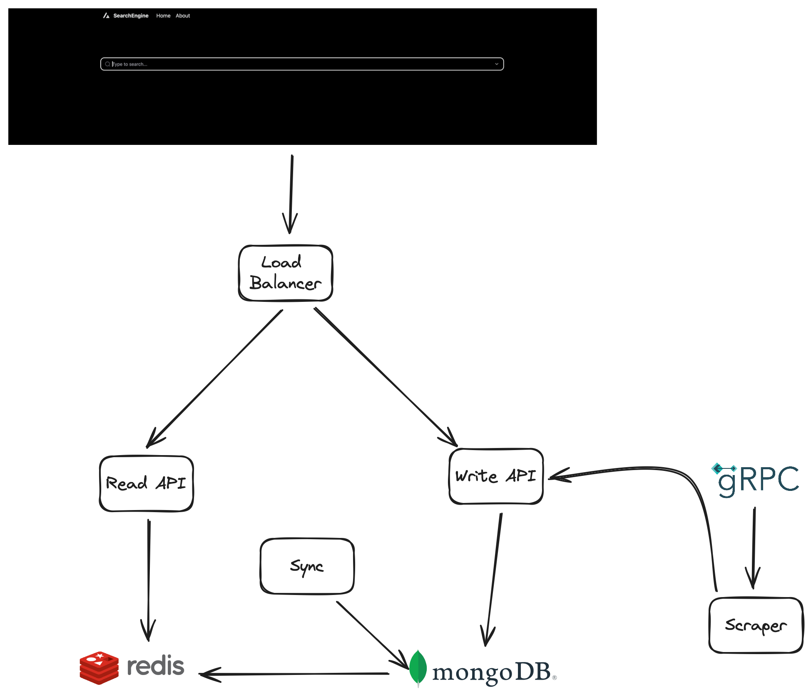

# Search Engine


## Introduction

Search engine is example project of search engine implementation for frontend. 

This project includes below:

- Trie implementation
- Google scraper
- Helm chart for deployment
- Basic web app





## Usage

You can check out open api specs:

|         | ReadApi                       | WriteApi                        |                   
|---------|-------------------------------|---------------------------------|
| OpenAPI | [read-api](api/read/api.yaml) | [write-api](api/write/api.yaml) |


For development environment:

```shell
make dev-run
```

Default Endpoints for microservices:

|          | ReadApi               | WriteApi              | Web App               |
|----------|-----------------------|-----------------------|-----------------------|
| Endpoint | http://localhost:8087 | http://localhost:8088 | http://localhost:5173 |


For k8s environment:

```shell
make k8s
```

Default Endpoints for microservices:

|          | ReadApi              | WriteApi              | Web App          |
|----------|----------------------|-----------------------|------------------|
| Endpoint | http://readapi.local | http://writeapi.local | http://app.local |

> You can start with add those endpoints to  **/etc/hosts** file
> 


---

In order to connect scraper microservice you should use grpc connection.


Usage with evans: 

```shell
 evans --proto protos/searchreq/searchreq.proto --host localhost --port 50076

```

After that you need to type 

```shell
call SearchHandler
```

Thus, you can connect with scraper. (If you type **Alan Turing** here, scraper microservice will be started to search with whole combinations that you give)


